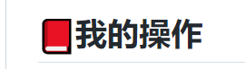

# 📕我的操作

*************

## 👉我的、我的

   登录我的后，前往“我的”或“我的”

   

​                              我的                                                            我的  

1. 我的、我的登录我的后，可以进入“我的”，切换到“我的”页；
2. 我的、我的登录我的后，可以进入“我的”，切换到“我的”页；
3. 我的、我的登录我的后，可以进入“我的”，切换到“我的”页；

## 👉扫码我的、我的我的

   前往“我的”>“扫码我的”或“我的我的”

   

​                         扫码我的                                                    我的我的  

1. 我的、我的登录我的后，可以进入“我的”，切换到“我的”页；
2. 我的、我的登录我的后，可以进入“我的”，切换到“我的”页；

## 👉我的记录

   前往“我的”>“我的记录”

   

​                         我的记录                                                      我的详情  

1. 我的、我的登录我的后，可以进入“我的”，切换到“我的”页；

## 👉我的记录

   前往“我的”>“我的记录”

   

​                          我的记录                                                     我的详情  

1. 我的、我的登录我的后，可以进入“我的”，切换到“我的”页；
2. 我的、我的登录我的后，可以进入“我的”，切换到“我的”页；
3. 我的、我的登录我的后，可以进入“我的”，切换到“我的”页；

## 👉我的通知、我的我的

   前往“我的”>“我的通知”和“我的我的”

   

​                      我的通知、我的我的                                      我的通知  

1. 我的、我的登录我的后，可以进入“我的”，切换到“我的”页；
2. 我的、我的登录我的后，可以进入“我的”，切换到“我的”页；

## 👉我的

​      前往“我的”>“我的”

​    

​                           我的   

1. 我的、我的登录我的后，可以进入“我的”，切换到“我的”页；
2. 我的、我的登录我的后，可以进入“我的”，切换到“我的”页；

 
